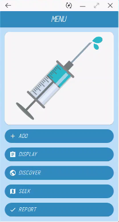

# MyInjections
### Description 
  
This application is aimed for people that have to take injections or just simply want to keep record of vaccinations that they have already taken. It is written in Kotlin in 
MVVM architecture.
It offers the following functionalities:
1) Adding new injection
2) Displaying taken injections and filtering them
3) Sharing new aricles and YouTube videos about vaccines to keep the user informed
4) Displaying the nearest pharmacies (to buy injection) or clinics (to vaccine) based on user location.
5) Ticking off injection (for people that have to take injections daily)
6) Sending Notifications with urgent information via Firebase

### Used libraries/frameworks/platforms/API:
Dev:pencil2::
- Android Room;
- Material Components for Android;
- Retrofit2; 
- Picasso;
- Firebase; 
- Android Coroutines;
- Google Maps API;
- Koin.  

Test:open_book::
- Espresso;
- JUnit4;
- Mockito.
